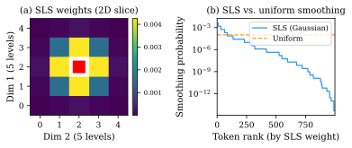
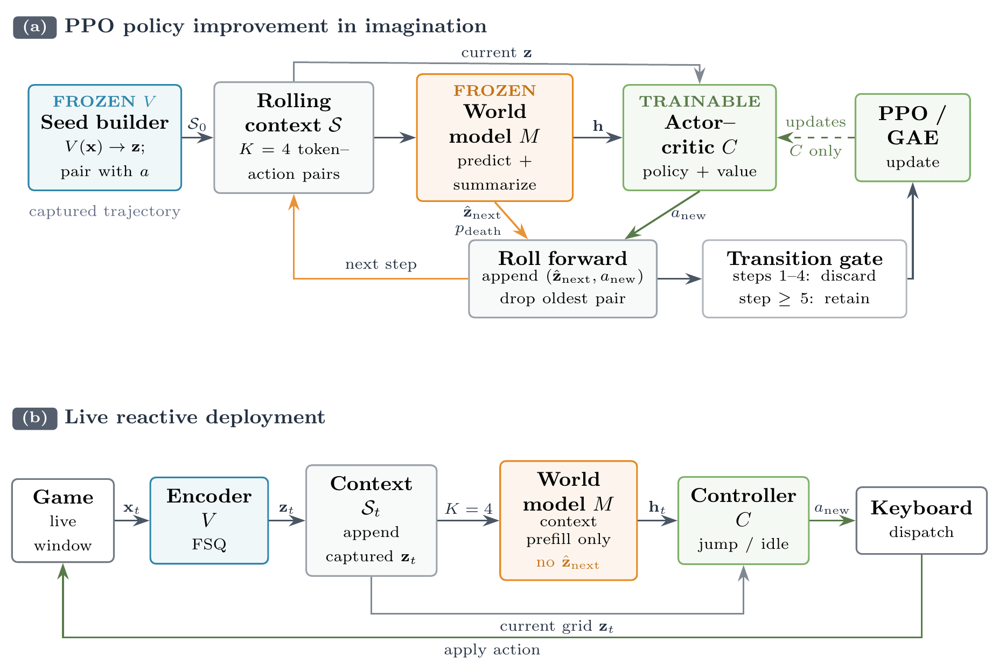

# SLS-WM
### Annealed Structured Label Smoothing for Discrete World Models

[Florent Tariolle](https://tariolle.github.io/)

SLS-WM studies **Structured Label Smoothing** (SLS), a metric-aware training objective for discrete world models. Hard cross-entropy treats every wrong token as equally wrong; SLS replaces the one-hot target with a local distribution over nearby tokenizer states.

The current paper separates two contributions: **annealed SLS** as a benchmarked CE replacement on an accepted discrete Atari world-model baseline, and a **Geometry Dash world-model control application** where the idea first emerged.

<p align="center">
   <b>[ <a href="https://tariolle.github.io/sls-wm/static/pdfs/sls_wm.pdf">Paper Draft</a> | <a href="https://tariolle.github.io/sls-wm/">Website</a> | <a href="https://github.com/Tariolle/sls-wm/blob/main/presentation/main.pdf">DeepDash Presentation</a> ]</b>
</p>

<p align="center">
  
</p>

## Method

Discrete tokenizers often carry useful geometry. In FSQ, neighbouring lattice codes can decode to visually similar patches; in VQ-style tokenizers, codebook or embedding distance can play the same role. A hard CE target ignores this structure: a near-miss token and an unrelated token receive the same penalty whenever neither is the exact target.

SLS turns that one-hot target into a kernel over token distances. The benchmark formulation is **annealed SLS**: use structured smoothing early to reduce brittle optimization, then anneal the smoothing mass to zero so late training is exactly CE. In Geometry Dash, fixed SLS is a domain-specific prior over semantically adjacent FSQ codes, because exact token identity can be stricter than decoded or control-relevant equivalence.

## Current Evidence

The controlled benchmark path uses [IRIS](https://arxiv.org/abs/2209.00588) on Pong and changes only the world-model loss target.

| Condition | First-seed final return | Role |
|:--|--:|:--|
| CE | `20.9375` | accepted-baseline objective |
| Fixed SLS | `0.125` | negative control: stabilizes early but keeps late bias |
| Annealed SLS | `19.625` | keeps much of the stability/sample-efficiency gain while returning near CE |

Multi-seed CE vs. annealed-SLS Pong runs are in progress. The final benchmark will report stability, sample efficiency, final/tail return, and seed failure-rate KPIs. Fixed SLS is retained as a diagnostic ablation for Atari, not as the method claim.

## Geometry Dash Application

The Geometry Dash application is the frozen environment-specific showcase. It uses an FSQ tokenizer, an action-conditioned transformer world model, and a lightweight actor-critic trained from BC warm-start plus PPO in imagined rollouts. It runs at 30 FPS through screen capture and can sample plausible level continuations by rolling the learned dynamics forward from real gameplay prefixes.

<p align="center">
  
</p>

The [DeepDash presentation](https://github.com/Tariolle/sls-wm/blob/main/presentation/main.pdf) documents the course-project Geometry Dash system where SLS originated: rollouts could be visually correct even when exact token accuracy stayed low, because nearby FSQ codes were penalized like unrelated codes.

## Scope

- SLS is tokenizer-metric aware, not FSQ-only: FSQ lattice distance is one instantiation; VQ codebook or embedding distance gives another.
- The Geometry Dash tokenizer remains reconstruction-anchored. A constrained FSQ-JEPA hybrid did not improve control, but this is not a claim against LeWorldModel or continuous-latent JEPA.
- The direct Atari port of the Geometry Dash controller path is retired. Atari appears only through accepted-baseline CE-vs-annealed-SLS validation.

## Using the code

**Environment.** Conda, PyTorch 2.10, CUDA 12.6.
```bash
conda run -n <env> python -m pip install -r requirements.txt
```

**Train the FSQ-VAE (V):**
```bash
python scripts/train_fsq.py
```

**Train the transformer world model (M) on the frozen FSQ tokens:**
```bash
python scripts/train_transformer.py
```

**Train the controller (C): BC warm-start, then PPO in imagination:**
```bash
python scripts/train_controller_bc.py
python scripts/train_controller_ppo.py --pretrained checkpoints/controller_bc_best.pt
```

**Deploy to the live game (screen capture, 30 FPS):**
```bash
python scripts/deploy.py
```

Cluster launches (SLURM, A100): `sbatch slurm/train_fsq.sl`, `sbatch slurm/train_transformer.sl`, `sbatch slurm/train_controller.sl`.

## Contact

Feel free to open [issues](https://github.com/Tariolle/sls-wm/issues). For questions or collaborations, contact `florent.tariolle@insa-rouen.fr`.
